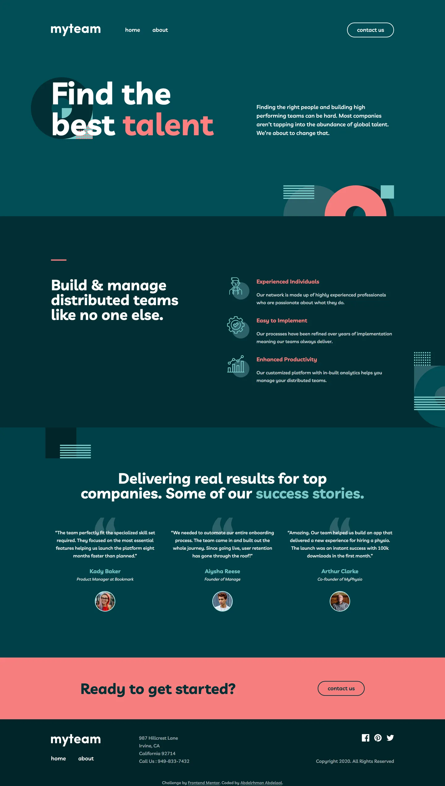

# Frontend Mentor - myteam multi-page website solution

This is a solution to the [myteam multi-page website challenge on Frontend Mentor](https://www.frontendmentor.io/challenges/myteam-multipage-website-mxlEauvW). Frontend Mentor challenges help you improve your coding skills by building realistic projects.

## Table of contents

- [Overview](#overview)
  - [Screenshot](#screenshot)
  - [Links](#links)
- [My process](#my-process)
  - [Built with](#built-with)
  - [Design deviations](#design-deviations)
- [Author](#author)

## Overview

### Screenshot

### Links

- Solution URL: [GitHub](https://github.com/MrBlackvanta/myteam-multi-page-website)
- Live Site URL: [Cloudflare](https://myteam-multi-page-website.abdelrhman-ahmed8881.workers.dev)
- Mirror: [Netlify](https://vanta-myteam-multi-page-website.netlify.app)

## My process

### Built with

- [Next.js 16](https://nextjs.org/) (App Router, React Compiler, Turbopack)
- [React 19](https://react.dev/)
- [TypeScript](https://www.typescriptlang.org/) (strict)
- [Tailwind CSS v4](https://tailwindcss.com/)

### Design deviations

#### Colour

Four text pairings fail WCAG AA against the backdrop they actually sit on. Each moved by
the smallest amount that clears the threshold, with hue and saturation held:

| Role                     | Backdrop  | Design    | Shipped   | Contrast before → after |
| ------------------------ | --------- | --------- | --------- | ----------------------- |
| Nav / footer link hover  | `#014E56` | `#F67E7E` | `#F89A9A` | 3.69 → **4.53**         |
| Mobile menu link hover   | `#2C6269` | `#F67E7E` | `#FBC4C4` | 2.68 → **4.51**         |
| Form label / placeholder | `#014E56` | `#99B8BB` | `#9AB9BB` | 4.46 → **4.51**         |
| Form error text          | `#014E56` | `#F67E7E` | `#F89A9A` | 3.69 → **4.53**         |

The last one is the worst case in the file. The design paints the errored field's
placeholder as 60% coral, which composites over the teal band to `#946B6E` — **2.06**,
barely lighter than the background it sits on. It takes the same `#F89A9A` as the error
message.

The single coral hover token necessarily became two, because `#F67E7E` sits on three
different backdrops across the site: it already clears AA on the footer's `#002529`
(6.33), needs a small lift on `#014E56`, and a large one on the mobile menu's `#2C6269`.

Left at the design's own value, deliberately:

- **`#F67E7E` on `#014E56` for "Ask us about"** (3.69) and **`#FF7F7F` on `#014E56` for
  the word "talent"** (3.86). Both are Bold at 32px and above, so 1.4.3 asks 3:1, not 4.5.
- **`#FF7F7F`** is not in the style guide at all — the design file paints the highlighted
  word a different coral from the palette's `#F67E7E`, so the file wins.
- **`#C4FFFE`** for the 2px ring around every avatar. Also off-palette, also drawn that
  way in the file (13.09 on the card, so contrast is not the reason it is there).

**`bg-pattern-about-2-contact-1.svg` ships without its `#79C8C7` stripes and `#F67E7E`
dots.** This is the largest deviation in the file and the only one that changes what a
sighted user sees, so it is worth the detail.

The design places this 200×200 tile at x 100–300 on both the contact hero and the
directors band, while the text column starts at 165 on desktop and the headings centre
over the tile on tablet. Its two light shape groups occupy the right half — exactly the
band the headings cross. Measured on the built page, heading ink landed on `#79C8C7` at
**1.93:1** and, worst of all, `#F67E7E` on `#F67E7E` at **1.00:1**, where the strokes
vanish outright.

Nothing recoverable was available. The tile cannot move: the container's left edge sits at
85px at 1280 and 97.5px at 768, so no offset clears the text at every breakpoint. The
colours cannot move either — the dots sit under a white heading on `/about` and a coral one
on `/contact`, and satisfying both would need them darker than the section background. The
asset has no other use, so a second "quiet" variant would leave the coloured one unused.
Dropping the two groups leaves the `#012F34` ring and `#2C6269` square, which take the
worst heading pixel to **6.87:1** against white and **5.63:1** against coral.

#### Type and spacing

- **Error messages are 12px, not the design's 10px.** Side effect: an errored field grows
  23px where the design's Active States frame grows it 14, so the fields below shift
  further down than that frame shows.
- **No letter-spacing is applied.** The form fields carry −0.0077em in the file, about
  0.115px at 15px — below the threshold where it renders as anything.
- **Form fields grow from the design's 15px to 16px on coarse pointers.** iOS Safari
  zooms the viewport whenever a focused field is under 16px, and the other escape —
  `maximum-scale=1` on the viewport — trades that for a 1.4.4 failure. The line-height
  stays at 25px, so the field boxes measure the same 42px and 84px either way; only the
  glyphs differ, and only on touch.
- **An `xl` breakpoint at 1280px was added.** The design supplies 375 / 768 / 1440 only;
  1280 is where the desktop grid stops fitting. Layouts were swept at 320 / 375 / 767 /
  768 / 1009 / 1279 / 1280 / 1440 with no horizontal overflow at any width.
- **Buttons use 30px of padding inside a 2px border, not 32px.** Every button stroke in
  the file is `align=INSIDE`, so the design's 153×48 and 123×48 boxes are outer boxes with
  the text 32px from the outer edge. 30 + 2 reproduces that; 32 + 2 does not.
- **The client logo strip breaks out of the page container on tablet** — 689px wide
  against the container's 573px, which is what the file draws.

#### States the design does not define

- **Focus.** Nothing in the file describes a keyboard focus state, so every interactive
  element takes a 2px `#79C8C7` outline at 2px offset (`#012F34` where the backdrop is
  coral). Form fields also switch their underline to `#79C8C7` on focus, which is the one
  hint the Active States frame does give — except an errored field, which keeps its coral
  underline so the error survives being focused. The focus ring is the focus indicator;
  the underline is a second, weaker one, and the error state outranks it.
- **The mobile menu closes on a backdrop tap, on Escape, and on crossing to `md`.** Only
  the close button is drawn in the file. The breakpoint case is not cosmetic: the panel
  lives inside a `md:hidden` wrapper, so a phone rotated to landscape crosses 768px and
  would otherwise leave the page scroll-locked and inert behind a menu it can no longer
  show. While it is open, `header`'s contents, `main` and `footer` are marked `inert`.
- **The directors' `+` toggle on hover** previews the other state's colour — coral becomes
  `#79C8C7` when closed, and the reverse when open.
- **The contact form's success state.** The brief specifies error messages only and there
  is no endpoint behind the form. A valid submit resets it and announces "Thanks for
  getting in touch. We'll reply shortly." in a live region beside the button.
- **The message field is resizable** (`resize-y` from a floor of the design's 84px).

#### Content

- **Aden Allan's role contradicts itself in the source material.** The desktop and mobile
  frames say "Account Manager"; the tablet frame and the starter `about.html` say "Head of
  Talent". The design file is the stated source of truth, and it is 2 frames to 1, so
  Account Manager ships.
- **Cruz Hamer's quote uses a curly apostrophe.** The starter HTML has the only straight
  `'` in the whole content set; it is normalised to match every other apostrophe.
- **The client logo order is unverified for two of the five.** The Verge and Tech Radar are
  both 165×28 in the design, and the file stores image fills without names — node ancestry,
  hashes against the shipped PNGs, and the embedded thumbnail all come up empty. The Verge
  ships first, Tech Radar fourth.
- **The client logos are optically centred, not top-aligned.** The design shares a top edge
  across the four short logos and lets Gadgets Now hang above them, which puts the three
  28px logos on one centre line, Jakarta Post 2.5px above it and Gadgets Now 2.5px below.
  Centring is the only rule that is internally consistent; it costs at most 5px inside a
  row whose outer box is exact.
- **The mobile client logos keep their aspect ratio.** The design scales them 0.886 wide by
  0.864 tall — a 2.7% vertical squash — which makes the band 1.2px shorter than shipped.
- **Social links point at `#`.** No destinations are given.
- **The Frontend Mentor attribution is not in the design.** It is the last line of the page,
  in the footer landmark.

#### Assets

- **The client logos ship as lossless WebP, served unoptimized.** Measured: routing the
  original PNGs through `next/image` produced 17,898 bytes of lossy WebP against 17,050
  bytes of source PNG — flat white line art with alpha is a case lossy encoding loses.
  Lossless WebP is 14,090 bytes, 21% under the optimizer's output, with five fewer
  server-side transforms.
- **Avatars are square files rounded in CSS.** The design draws circles; baking the crop
  into the asset would make it unusable at any other shape.
- **Three icons were re-exported at a common 72×72 box.** `icon-person.svg` ships as 65×72
  with a `translate(-7)`, trimmed differently from `icon-cog.svg` and `icon-chart.svg`,
  which misaligns the three feature rows.
- **Nothing in the file uses a shadow, and no corner radius appears outside the pill
  buttons and the avatar circles** — checked rather than assumed.
- **`og.png` is a 1200×630 shot of the home hero**, 37 KB, generated from the built site
  rather than drawn. It is not in the design; the challenge has no share card. All three
  routes point at it, each with its own title, description and URL.

## Author

- UpWork - [Abdelrhman Abdelaal](https://upwork.com/freelancers/~01f0a9479696b61f49)
- Frontend Mentor - [@MrBlackvanta](https://www.frontendmentor.io/profile/MrBlackvanta)
- LinkedIn - [Abdelrhman Abdelaal](https://www.linkedin.com/in/abdelrhman-vanta/)
